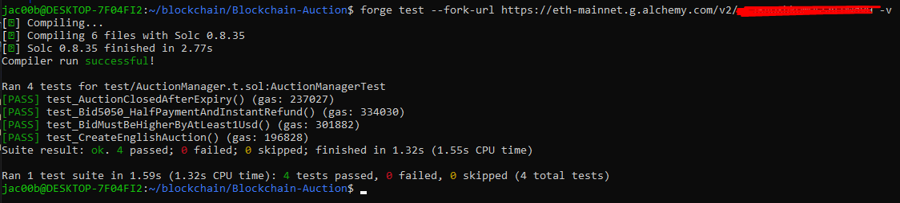

Aby odpalić test uruchom `forge test --fork-url https://eth-mainnet.g.alchemy.com/v2/TWÓJ_KLUCZ -v`

test 1 — createEnglishAuction zapisuje poprawne dane (id, typ, sprzedawca, minBid, isClosed=false)

test 2 — oferta równa najwyższej jest odrzucana (minUsdRequired = highestBid + 1 USD)

test 3 — licytacja 50/50 przyjmuje tylko połowę ETH, zapisuje highestBidIs5050=true, i przy przebijaniu natychmiast zwraca ETH poprzedniemu liderowi

test 4 — getAuction zwraca isClosed=true po skip(61), a placeBid revertuje z TimeExpired

## Wyniki testów

